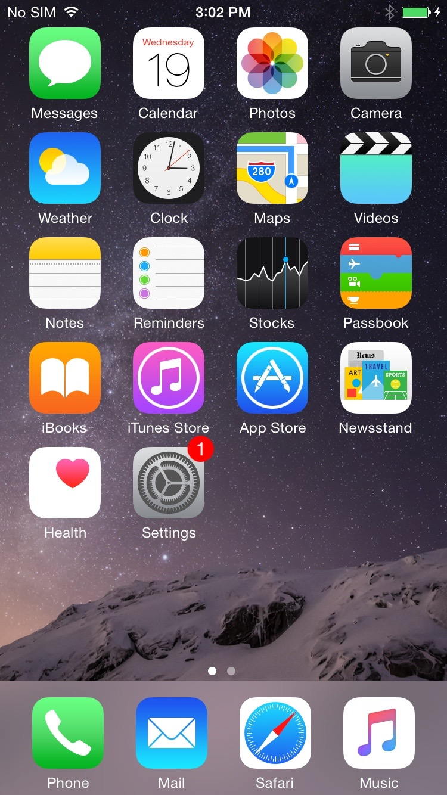
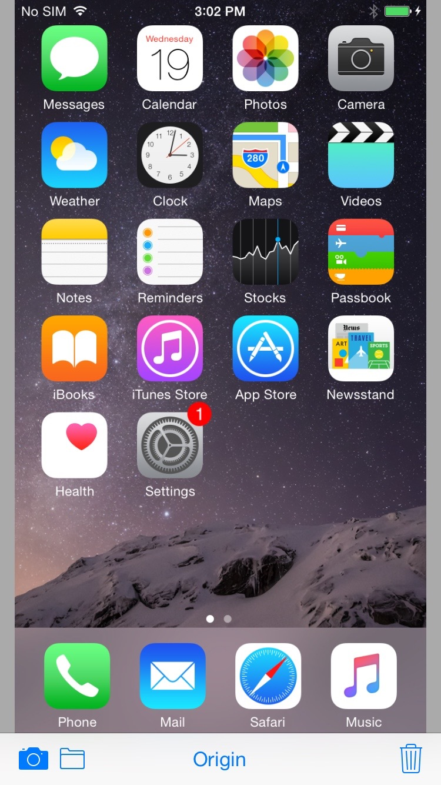
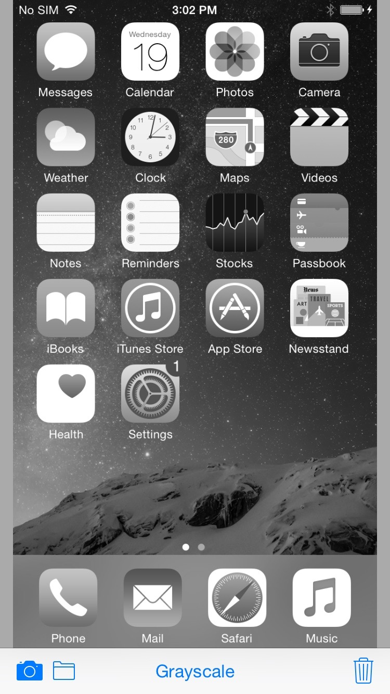

# PhotoConvertDemo
This is a simple demo for image color conversion in iOS platform using OpenCV with Swift. You have to download OpenCV linking library and add it to this project. A simple tutorial is in [here](http://docs.opencv.org/doc/tutorials/ios/hello/hello.html), or you can build library manually from OpenCV source code [here](http://docs.opencv.org/doc/tutorials/introduction/ios_install/ios_install.html).

## Example

You can take a photo or load image for Photo Library. Image will show in center view and fit size automatically.

 Original image

 Loading to application

 Conversion result

#Reference
- [OpenCV Website](http://opencv.org/)
